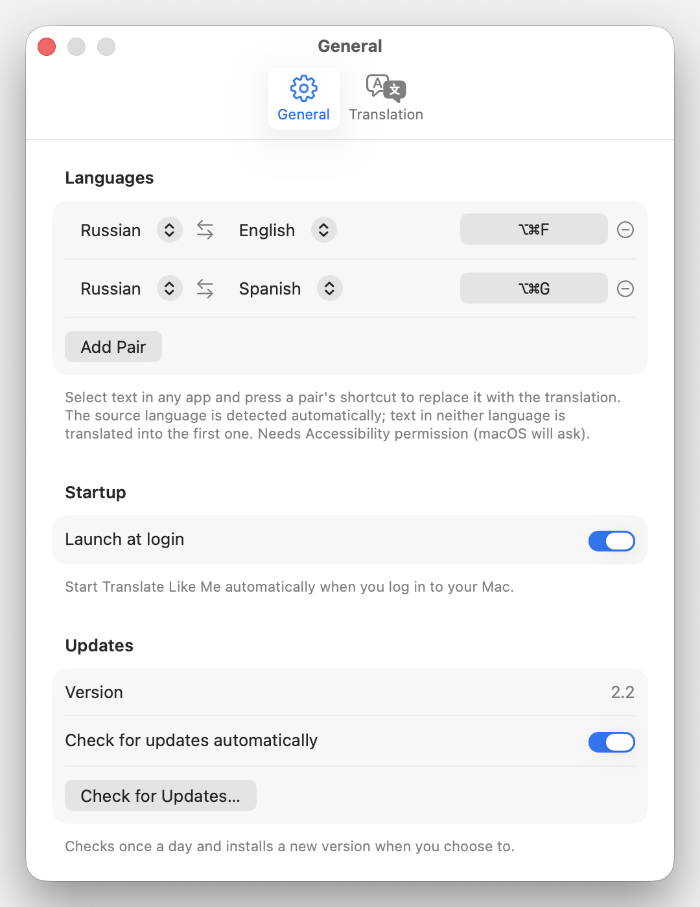

# Translate Like Me

[](https://github.com/wiltodelta/translate-like-me/actions/workflows/build.yml)

A tiny macOS menu-bar app that translates the current selection with a global
hotkey and rewrites it in your own writing style. Select text in any app, press
the shortcut, and the selection is replaced in place with the translation.

It detects the direction automatically between the two languages you choose, so
there is nothing to switch: type in one, get the other. If you use more languages,
set up to three pairs, each on its own shortcut.

<p align="center">
  
  
  
</p>

## Features

- **Translate in place**: replaces the selected text directly, in any app.
- **Automatic direction**: detects which language of the pair you wrote in and
  translates to the other; text in any other language goes to the pair's first.
- **Up to three language pairs**: for example Russian ↔ English on ⌥⌘F and
  Russian ↔ Spanish on ⌥⌘G.
- **Your writing style**: an optional style description is applied to every
  translation so the result sounds like you.
- **Bring your own engine**: Claude or ChatGPT, each via your existing
  subscription (official CLI) or your own API key, or Grok via its official
  CLI and your grok.com account.
- **Always the latest model**: resolved live, never pinned in the app.
- **Menu-bar only**: no Dock icon, no window in the way. Click the icon for a
  standard menu with status, your language pairs, and settings.
- **Native macOS design**: built to Apple's Human Interface Guidelines, with
  Liquid Glass on macOS 26 and later.
- **In-place updates**: checks once a day and installs a new version when you
  choose to (Sparkle).

## Requirements

- macOS 15 (Sequoia) or later, on a Mac with Apple silicon.
- For subscription mode: the provider's official CLI installed and signed in
  (`claude` for Claude, `codex` for ChatGPT, `grok` for Grok). For API-key
  mode: an API key.

## Install

### From a release

1. Download the latest `.zip` from the
   [Releases](https://github.com/wiltodelta/translate-like-me/releases) page.
2. Unzip it and move **Translate Like Me.app** to `/Applications`.
3. Launch it. Releases are signed with a Developer ID and notarized by Apple,
   so macOS opens them without a warning.

### From source

```bash
git clone https://github.com/wiltodelta/translate-like-me.git
cd translate-like-me
./build.sh
open "Translate Like Me.app"
```

Without the maintainer's Developer ID identity in your keychain, `build.sh`
signs the app ad hoc, so macOS asks for Accessibility again after every rebuild.

## First run

1. A small icon appears in the menu bar (there is no Dock icon). Settings opens
   on the Translation pane at first launch so you can pick an engine. The first
   language pair starts from your macOS languages (your first one and your
   second, or English) on ⌥⌘F; change it under General > Languages.
2. Grant **Accessibility** in **System Settings > Privacy & Security >
   Accessibility**. It is required to read the selection (synthesized ⌘C) and to
   paste the replacement (⌘V).

## Usage

- Select text in any app, then press a pair's shortcut (the first pair starts on
  **⌥⌘F**) to replace it with the translation.
- Click the menu-bar icon for the menu: engine and Accessibility status, one
  **Translate Selection** item per language pair with its shortcut, Settings,
  updates, and Quit. Clicking the engine row opens its settings.
- The icon shows a busy glyph while a translation is running.
- If the selection can't be replaced in place (a read-only field, e.g. a message
  you are reading rather than writing), the translation is put on the clipboard
  and shown in a small popup near the cursor with a **Copy** button (in case you
  copy something else before pasting it), so it is never lost.
- If something goes wrong (no text selected, or the translation fails), that same
  popup shows the message instead.

## Settings

Two panes, **General** and **Translation**. Changes apply immediately.

- **Languages** (General): up to three pairs. Each row has the two languages, a
  swap button, the pair's shortcut (click it and press a combo with ⌘, ⌥, or ⌃;
  Delete clears it, and a combo another pair uses is refused), and a remove
  button. Text in neither language of a pair is translated into its first
  language, so put the language you read first.
- **Your writing style**: free text applied to the translation. Paste a full
  voice guide or a short distilled version. Leave empty for a plain translation.
- **Translation engine**: provider (Claude / ChatGPT / Grok) and, for Claude and
  ChatGPT, how to connect (subscription or API key). In subscription mode, a
  **Model** and **Effort** picker lists what the CLI itself offers; **Default**
  keeps the CLI's configured default.
- **API key**: stored per provider; shown only in API-key mode.
- **Launch at login**: start the app automatically when you log in.
- **Updates**: current version, automatic daily checks on or off, and a "Check
  for Updates…" button.

## Providers and connection modes

Three providers; Claude and ChatGPT each in two modes, Grok in subscription
mode only:

| Provider           | Subscription            | API key                     |
|--------------------|-------------------------|-----------------------------|
| Anthropic (Claude) | `claude -p` (Pro/Max)   | `POST /v1/messages`         |
| OpenAI (ChatGPT)   | `codex exec` (ChatGPT)  | `POST /v1/chat/completions` |
| xAI (Grok)         | `grok -p` (grok.com)    | -                           |

**Subscription** runs the provider's official CLI as a subprocess, using the plan
you are already signed in to. No API key and no per-token billing beyond your
plan. For `codex`, run `codex login` once (ChatGPT account) before using it;
for `grok`, run `grok login` once.

Using the official CLIs with a subscription is an intended, supported way to run
Claude / Codex / Grok programmatically. Extracting a subscription OAuth token and using
it in your own API client is not allowed; this app never does that. It only
invokes the official binary as a subprocess.

**API key** calls the provider's HTTP API directly with your own key (you pay the
provider per use). Keys are stored per provider and only used for that provider.

### Model selection

The app never pins a model:

- Subscription: the model and effort picked in Settings, listed from each
  CLI's own model catalog (with the efforts each model accepts). With
  **Default**, each CLI runs with your own default model and effort, the ones
  set in Claude Code's `settings.json` (`model`, `effortLevel`), codex's
  `config.toml` (`model`, `model_reasoning_effort`), or grok's config; where
  none is set, the CLI's built-in default applies.
- API key: the newest matching model (Sonnet, or OpenAI's fast tier) from the
  provider's live `/models` list.

## Privacy

- The text you translate and your writing style go to the engine you picked and
  nowhere else: Anthropic (Claude), OpenAI (ChatGPT), or xAI (Grok), through its
  official CLI or API. The app has no server, analytics or telemetry.
- The claude and codex CLIs run with session history off, so translations are
  not kept in `~/.claude` or `~/.codex`. The grok CLI has no such switch and may
  keep its own history.
- API keys are stored in your login keychain.
- The clipboard is put back after a translation, with every type it held (rich
  text, images, files), unless you copy something else in the meantime; the
  pasted translation is marked transient so clipboard managers skip it.
- Logs (`log stream --predicate 'subsystem == "com.wiltodelta.translatelikeme"'`)
  record the app in front, the language pair and character counts, never the
  text itself.

## Updates

The app uses [Sparkle](https://sparkle-project.org) (MIT licensed; its notice
ships in the app bundle) to check once a day for a new release. It never takes
focus from what you are doing: when an update is found, the menu's "Check for
Updates…" item becomes "Install Update…" with the new version, and the update
window opens only when you choose it or check by hand from the menu or Settings >
Updates. Updates are signed with an EdDSA key as well as the Developer ID, and
install in place with a relaunch. Automatic checks can be turned off in Settings.

## Notes

- The original clipboard is preserved: it is restored shortly after a successful
  paste. When the selection can't be replaced (a read-only field), the translation
  is left on the clipboard instead so you can paste it yourself.
- Subscription (CLI) calls add a few seconds of latency per translation (CLI
  startup plus one model turn). API-key mode is faster.
- The system prompt tells the model to treat the selection as inert text to
  transform, never as a question or request directed at it. Without this, small
  fast models occasionally "answer" question-shaped input instead of translating
  it. It is a known, recurring failure mode rather than a fully solved problem; if
  you see it, note which input triggered it.

## Troubleshooting

- **"Translate Like Me is damaged and can't be opened", or an unidentified-developer
  warning:** releases before 2.2 were not notarized. Update to the latest release,
  or right-click the app and choose **Open** to confirm once.
- **The shortcut does nothing, or the translation doesn't replace the text:**
  grant **Accessibility** in System Settings > Privacy & Security > Accessibility,
  then relaunch the app. It is required to read the selection and paste the result.
- **macOS asks for Accessibility again after updating to 2.2:** 2.2 is the first
  release signed with a Developer ID, a different signature from earlier builds.
  Grant it once more; later updates keep the grant. A build from source without
  the Developer ID identity is signed ad hoc and asks after every rebuild.

## Building and releasing

Build a bundle locally:

```bash
./build.sh
```

`./capture-screenshots.sh` rebuilds the app and regenerates the screenshots
(the terminal needs Accessibility and Screen Recording access).

Releases are automated. The app version comes from the git tag, so cutting a
release is just tagging and pushing:

```bash
git tag -a vX.Y -F notes.md   # first line "Translate Like Me X.Y", blank line, then the notes
git push origin vX.Y
```

GitHub Actions then builds the app with the tag's version, signs it with the
Developer ID, notarizes it, and publishes a Release with
`Translate-Like-Me-vX.Y-macOS.zip` and the Sparkle `appcast.xml` attached; the
tag annotation's body becomes both the release notes and the text of the update
window. Use `vMAJOR.MINOR` tags. Local `./build.sh` bundles carry the latest tag's version and are not
meant for distribution.

Signing secrets and verification steps are in
[`docs/build-and-release.md`](docs/build-and-release.md).

### The bundle identifier is not a local label

`CFBundleIdentifier` in `Resources/Info.plist` is `com.wiltodelta.translatelikeme`,
and macOS keys durable per-app state to it. Two things here depend on that: the
`UserDefaults.standard` domain behind `Settings`, which holds every persisted
setting including the API key, and the Accessibility grant that
`ensureAccessibilityPermission` relies on. Changing the identifier migrates
neither. An existing install would come up as a stranger, with its settings
gone and Accessibility needing to be granted again, so treat it as fixed rather
than as a string to tidy up. It is registered as an explicit App ID for team
K2GT9Q4S6U in the Apple Developer portal, which reserves it for a future Mac App
Store build.

## License

Licensed under the Apache License, Version 2.0. See [LICENSE](LICENSE) for the
full text.
