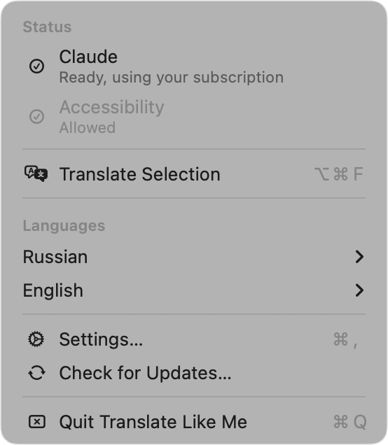
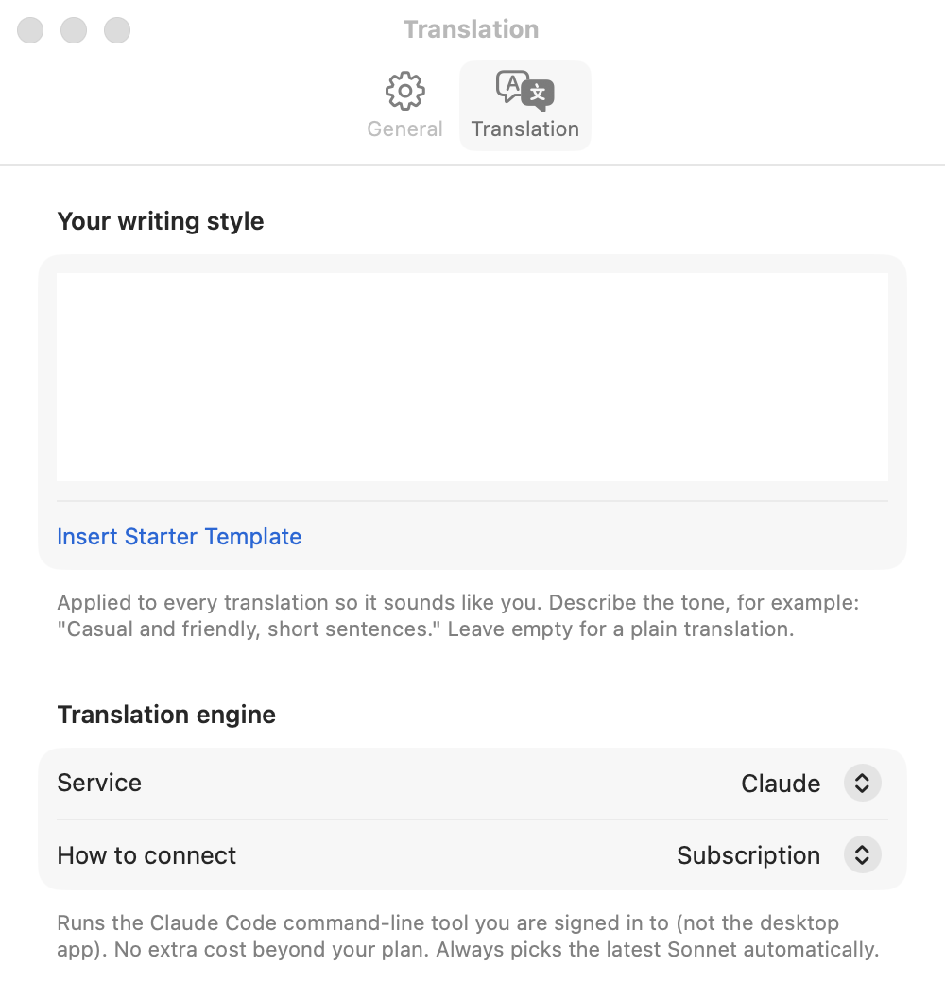

# Translate Like Me

[](https://github.com/wiltodelta/translate-like-me/actions/workflows/build.yml)

A tiny macOS menu-bar app that translates the current selection with a global
hotkey and rewrites it in your own writing style. Select text in any app, press
the shortcut, and the selection is replaced in place with the translation.

It detects the direction automatically between the two languages you choose, so
there is nothing to switch: type in one, get the other.

<p align="center">
  
  
</p>

## Features

- **Translate in place**: replaces the selected text directly, in any app.
- **Automatic direction**: detects which of your two languages you wrote in and
  translates to the other.
- **Your writing style**: an optional style description is applied to every
  translation so the result sounds like you.
- **Bring your own engine**: Claude or ChatGPT, each via your existing
  subscription (official CLI) or your own API key, or Grok via its official
  CLI and your grok.com account.
- **Always the latest model**: resolved live, never pinned in the app.
- **Menu-bar only**: no Dock icon, no window in the way. Click the icon for a
  standard menu with status, languages, and settings.
- **Native macOS design**: built to Apple's Human Interface Guidelines, with
  Liquid Glass on macOS 26 and later.
- **Update checks**: checks GitHub Releases on launch and from Settings.

## Requirements

- macOS 15 (Sequoia) or later, on a Mac with Apple silicon.
- For subscription mode: the provider's official CLI installed and signed in
  (`claude` for Claude, `codex` for ChatGPT, `grok` for Grok). For API-key
  mode: an API key.

## Install

### From a release

1. Download the latest `.zip` from the
   [Releases](https://github.com/wiltodelta/translate-like-me/releases) page.
2. Unzip it and move **Translate Like Me.app** to `/Applications`.
3. Launch it. Because the build is self-signed for personal use (not notarized),
   macOS may warn on first launch. Right-click the app and choose **Open** to
   confirm once.

### From source

```bash
git clone https://github.com/wiltodelta/translate-like-me.git
cd translate-like-me
./build.sh
open "Translate Like Me.app"
```

`build.sh` signs the app with a stable local identity (see the comment at the top
of the script) so the Accessibility grant survives rebuilds. If that identity is
missing it falls back to ad-hoc signing, and macOS asks for Accessibility again
after every rebuild.

## First run

1. A small icon appears in the menu bar (there is no Dock icon). Settings opens
   on the Translation pane at first launch so you can pick an engine; pick the
   two languages in the menu-bar menu.
2. Grant **Accessibility** in **System Settings > Privacy & Security >
   Accessibility**. It is required to read the selection (synthesized ⌘C) and to
   paste the replacement (⌘V).

## Usage

- Select text in any app, then press the shortcut (default **⌥⌘F**) to replace it
  with the translation.
- Click the menu-bar icon for the menu: engine and Accessibility status,
  **Translate Selection**, the two languages (each a submenu), Settings, updates,
  and Quit. Clicking the engine row opens its settings.
- The icon shows a busy glyph while a translation is running.
- If the selection can't be replaced in place (a read-only field, e.g. a message
  you are reading rather than writing), the translation is put on the clipboard
  and shown in a small popup near the cursor with a **Copy** button (in case you
  copy something else before pasting it), so it is never lost.
- If something goes wrong (no text selected, or the translation fails), that same
  popup shows the message instead.

## Settings

Two panes, **General** and **Translation**. Changes apply immediately.

- **Keyboard shortcut**: click the field and press a new combo to change it (must
  include a modifier).
- **Your writing style**: free text applied to the translation. Paste a full
  voice guide or a short distilled version. Leave empty for a plain translation.
- **Translation engine**: provider (Claude / ChatGPT / Grok) and, for Claude and
  ChatGPT, how to connect (subscription or API key).
- **API key**: stored per provider; shown only in API-key mode.
- **Launch at login**: start the app automatically when you log in.
- **Updates**: current version and a "Check for Updates…" button.

Languages are picked in the menu-bar menu, not in Settings.

## Providers and connection modes

Three providers; Claude and ChatGPT each in two modes, Grok in subscription
mode only:

| Provider           | Subscription            | API key                     |
|--------------------|-------------------------|-----------------------------|
| Anthropic (Claude) | `claude -p` (Pro/Max)   | `POST /v1/messages`         |
| OpenAI (ChatGPT)   | `codex exec` (ChatGPT)  | `POST /v1/chat/completions` |
| xAI (Grok)         | `grok -p` (grok.com)    | -                           |

**Subscription** runs the provider's official CLI as a subprocess, using the plan
you are already signed in to. No API key and no per-token billing beyond your
plan. For `codex`, run `codex login` once (ChatGPT account) before using it;
for `grok`, run `grok login` once.

Using the official CLIs with a subscription is an intended, supported way to run
Claude / Codex / Grok programmatically. Extracting a subscription OAuth token and using
it in your own API client is not allowed; this app never does that. It only
invokes the official binary as a subprocess.

**API key** calls the provider's HTTP API directly with your own key (you pay the
provider per use). Keys are stored per provider and only used for that provider.

### Model selection

The app never pins a model:

- Subscription: each CLI runs with your own default model and effort, the ones
  set in Claude Code's `settings.json` (`model`, `effortLevel`), codex's
  `config.toml` (`model`, `model_reasoning_effort`), or grok's config; where
  none is set, the CLI's built-in default applies.
- API key: the newest matching model (Sonnet, or OpenAI's fast tier) from the
  provider's live `/models` list.

## Updates

The app checks GitHub Releases a few seconds after launch and offers to open the
download page when a newer version is tagged. You can also check on demand from
Settings > Updates. It is a check-and-notify updater, not a silent in-place
installer: you download the new build and replace the app yourself.

## Notes

- The original clipboard is preserved: it is restored shortly after a successful
  paste. When the selection can't be replaced (a read-only field), the translation
  is left on the clipboard instead so you can paste it yourself.
- Subscription (CLI) calls add a few seconds of latency per translation (CLI
  startup plus one model turn). API-key mode is faster.
- The system prompt tells the model to treat the selection as inert text to
  transform, never as a question or request directed at it. Without this, small
  fast models occasionally "answer" question-shaped input instead of translating
  it. It is a known, recurring failure mode rather than a fully solved problem; if
  you see it, note which input triggered it.

## Troubleshooting

- **"Translate Like Me is damaged and can't be opened", or an unidentified-developer
  warning:** Gatekeeper blocking a non-notarized app. Right-click the app and
  choose **Open** to confirm once, or clear the quarantine flag with
  `xattr -cr "/Applications/Translate Like Me.app"`.
- **The shortcut does nothing, or the translation doesn't replace the text:**
  grant **Accessibility** in System Settings > Privacy & Security > Accessibility,
  then relaunch the app. It is required to read the selection and paste the result.
- **macOS asks for Accessibility again after a rebuild:** the stable signing
  identity is missing, so `build.sh` fell back to ad-hoc. Recreate the identity
  (see the comment in `build.sh`) to keep the grant across rebuilds.

## Building and releasing

Build a bundle locally:

```bash
./build.sh
```

Releases are automated. The app version comes from the git tag, so cutting a
release is just tagging and pushing:

```bash
git tag -a v1.3 -m "Translate Like Me 1.3"
git push origin v1.3
```

GitHub Actions then stamps the version into `Info.plist`, builds the app,
and publishes a Release with `TranslateLikeMe-vX.Y-macOS.zip` attached. Use
`vMAJOR.MINOR` tags; the in-app updater compares the tag to the installed
version. Local `./build.sh` bundles keep whatever version is in `Info.plist`
and are not meant for distribution.

One manual step remains after each release: the CI zip is ad-hoc signed, while
the Accessibility grant is keyed to the stable local signing identity. Re-sign
and replace the release asset locally so installs keep their permissions
(the exact commands are in
[`docs/build-and-release.md`](docs/build-and-release.md)).

### The bundle identifier is not a local label

`CFBundleIdentifier` in `Resources/Info.plist` is `com.wiltodelta.translatelikeme`,
and macOS keys durable per-app state to it. Two things here depend on that: the
`UserDefaults.standard` domain behind `Settings`, which holds every persisted
setting including the API key, and the Accessibility grant that
`ensureAccessibilityPermission` relies on. Changing the identifier migrates
neither. An existing install would come up as a stranger, with its settings
gone and Accessibility needing to be granted again, so treat it as fixed rather
than as a string to tidy up.

## License

Licensed under the Apache License, Version 2.0. See [LICENSE](LICENSE) for the
full text.
